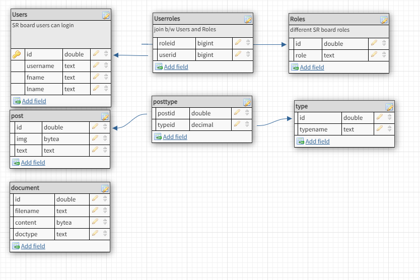

**Hello!** Welcome to my repository
*BTW I'm Lukerdue checkout [my personal github](http://github.com/Lukerdue)*

This is the Backend repository I'm building for a personal side project. I'm building a standalone application
with the end goal of donating a finished product to a non-profit that I grew up with called JuMP CO.

They're a youth theatrical performance group.

Anyway, their website currently is a ~~hideous~~ weebly they've had since I joined them. I recently graduated from Lambda School
as a full stack web developer. SO I wanted to do this side project as a sort of token of appreciation
for their sort of raising me in the theatre and introducing me to my favorite hobby (even into adulthood).As well as continuing my education and growing more as a developer.

---
The link to the final site will be >>>here<<< once I get that far

---
This project uses **Maven** and **Java** spring for a RestAPI backend system I'm coding the project on Jetbrain's 
IntelliJ text editor.

here is my database architecture:

I'll be using **PostgreSQL** and deploying to Heroku for the final product.

